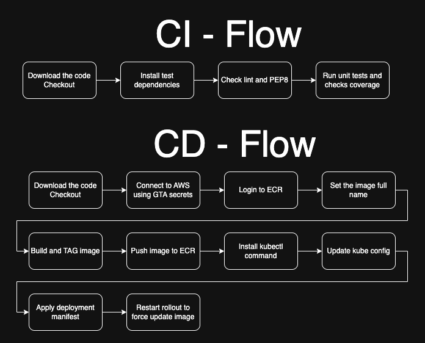

# CI/CD Pipeline 

For the pipelines we are using GitHub actions.
TO find it go to the folder .github/workflows, all actions must be always there.

How is works?
Someone opens a PR, but it can be configured to be a push or manually triggered.
After that we check if the code was changed and if yes, we start some actions.
Check the diagem below.

The CI and CD workflows uses generic services that receives some inputs from the caller like, credentials, etc.
You can check the source code here

- [generic-service-ci](.github/workflows/service-ci.yaml)
- [generic-service-cd](.github/workflows/service-cd.yaml)
- [challenge-api](.github/workflows/challenge-api.yaml)
- [challenge-consumer](.github/workflows/challenge-consumer.yaml)

In the flow below you can check all the steps used for each flow.

This CD sample deploy the code to a kubernetes environment hosted in AWS but using GitHub actions it's easy to adpat to any other cloud.
