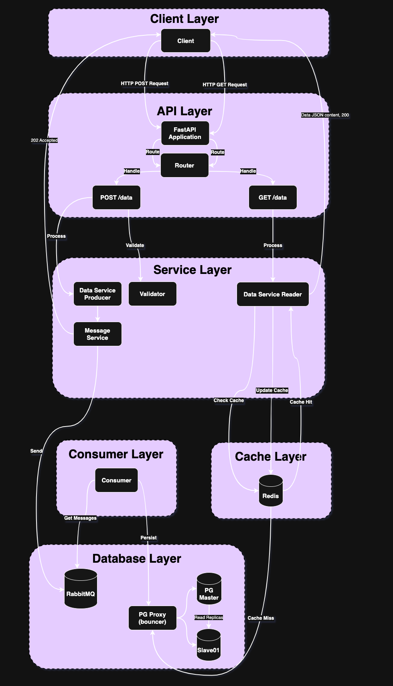

# Microservice Design Challenge

A high-performance Python microservice built with FastAPI, designed to handle thousands of concurrent requests while maintaining response times under 500ms with a maximum degradation of 10% under load.

## Performance Requirements
- Response time: < 500ms
- Maximum degradation under load: 10%
- High throughput: Thousands of concurrent requests
- Asynchronous processing for heavy operations
- Efficient caching strategy
- Horizontal scalability

The image below illustrates the architecture.



### Read the details about the architecture [Architecture Design](ARCHITECTURE.md)
### Read the details for the [Microservice Design](MICROSERVICE.md)
### Check how to run the app using **Docker** here [Containerization](CONTAINERIZATION.md)
### Check the **Kubernetes Deployment** here [Kubernetes Deployment](K8SDEPLOYMENT.md)
### Check the **CI/CD Deployment** details here [CI/CD - GitHub Actions](CICDGHA.md)
### Check the **Testing Strategy** details here [Testing Strategy](TESTING.md)

## Setup and Installation

### Environment Setup
```bash
# Create and activate virtual environment
python -m venv venv
source venv/bin/activate

# Install dependencies
pip install -r requirements.txt
```

### Configuration
Copy `.env.example` to `.env` and fill it with your secrets.

### Running the Service
```bash
# Start the API service
uvicorn main:app --host 0.0.0.0 --port 8000 --reload

# Start the consumer
python consumer/main.py
```

## API Documentation
Once the service is running, access the OPEN API documentation at:
- Swagger UI: `http://localhost:8000/docs`

## Monitoring
- Health check endpoints
- Error logging

## Development Guidelines
1. Follow PEP 8 style guide, we are using BLACK and RUFF on the pipelines.
2. Write unit tests, 60% coverage.
3. Use type hints

## About the costs
To reduce costs we could use a python Celery with Redis and save RabbitMQ costs.
The host this solution on AWS that costs are under $800 month.
What is very expnesive in my opinion.

## Future optimizations and enhancements

1. **Add monitoring**
   - Implement comprehensive system monitoring using tools like Prometheus
   - Track key metrics such as response times, error rates, and resource usage
   - Set up alerting for critical system events
   - Monitor application health and performance in real-time

2. **Improve tests**
   - Increase test coverage
   - Implement end-to-end testing for all API endpoints
   - Add performance and load testing scenarios

3. **Add observability (Grafana, Prometheus, Datadog, etc)**
   - Implement centralized logs
   - Design custom dashboards for system metrics
   - Implement real-time monitoring for application performance

4. **Create Queue alerts and autoscaling**
   - Implement real-time monitoring of queue sizes and processing times
   - Create notifications for failed message processing
   - Implement dead letter queues for failed messages
   - Add autoscaling using KEDA, AWS Auto Scaling, etc.